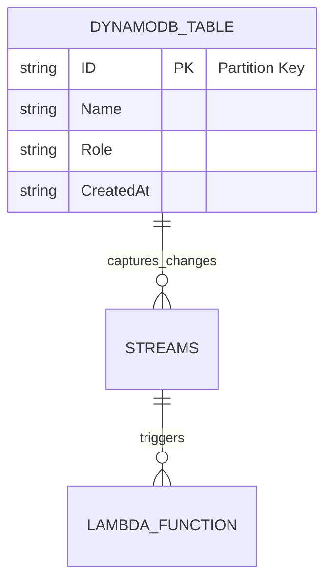

# DynamoDBForge

---

## 🔥 Overview

**DynamoDBForge** is a high-performance, scalable, and fully managed NoSQL database repository built on AWS DynamoDB.
It focuses on speed, flexibility, and reliability for modern cloud applications.

This repository demonstrates **key DynamoDB concepts**, **best practices**, and **hands-on implementations** for real-world usage. It is ideal for developers, cloud engineers, and data enthusiasts looking to master NoSQL databases with AWS.

---

## 🚀 Features

* Fully managed NoSQL database on AWS
* Ultra-fast read/write operations
* Scalable and serverless
* Flexible schema design
* High availability and durability
* Event-driven architecture support (DynamoDB Streams + Lambda)
* Global tables for multi-region replication
* Fine-grained access control using IAM
* Automatic backups and point-in-time recovery

---

## 🛠️ Core Concepts

1. **Tables** – Organize your data in DynamoDB tables with partition keys and optional sort keys.
2. **Items** – Individual records stored in tables (like rows in relational DBs).
3. **Attributes** – Fields within each item (like columns).
4. **Primary Keys** – Unique identifiers for each item (Partition Key or Partition + Sort Key).
5. **Secondary Indexes** – Query flexibility beyond the primary key (Global Secondary Index & Local Secondary Index).
6. **Provisioned & On-Demand Capacity** – Manage throughput and costs efficiently.
7. **Streams** – Capture table changes in real-time for event-driven applications.
8. **Global Tables** – Replicate your DynamoDB tables across multiple AWS regions for low-latency access.
9. **TTL (Time To Live)** – Automatic deletion of expired data to optimize storage.
10. **Transactions** – Ensure atomicity, consistency, isolation, and durability (ACID) across multiple items.

---

## 📦 Step-by-Step Creation Guide

### 1. Create a DynamoDB Table

```bash
aws dynamodb create-table \
    --table-name DynamoDBForgeTable \
    --attribute-definitions AttributeName=ID,AttributeType=S \
    --key-schema AttributeName=ID,KeyType=HASH \
    --provisioned-throughput ReadCapacityUnits=5,WriteCapacityUnits=5
```

### 2. Insert Items

```bash
aws dynamodb put-item \
    --table-name DynamoDBForgeTable \
    --item '{"ID": {"S": "1"}, "Name": {"S": "Arkan"}, "Role": {"S": "Developer"}}'
```

### 3. Query Items

```bash
aws dynamodb get-item \
    --table-name DynamoDBForgeTable \
    --key '{"ID": {"S": "1"}}'
```

### 4. Update Items

```bash
aws dynamodb update-item \
    --table-name DynamoDBForgeTable \
    --key '{"ID": {"S": "1"}}' \
    --update-expression "SET Role = :r" \
    --expression-attribute-values '{":r": {"S": "Senior Developer"}}'
```

### 5. Delete Items

```bash
aws dynamodb delete-item \
    --table-name DynamoDBForgeTable \
    --key '{"ID": {"S": "1"}}'
```

---

## 📝 Best Practices

* Use **Partition Keys** wisely to distribute load evenly
* Avoid hot partitions
* Use **On-Demand Capacity** for unpredictable workloads
* Monitor table metrics with **CloudWatch**
* Enable **Streams** for real-time updates
* Apply **Global Secondary Indexes** strategically
* Use **Transactions** for critical multi-item operations
* Enable **Point-In-Time Recovery (PITR)** for backup and restore

---

## ⚡ Use Cases

* Real-time analytics
* E-commerce product catalogs
* IoT data storage
* Serverless applications
* Mobile and web apps

---

## 📊 DynamoDB Table Structure Diagram



**Explanation:**

* `DYNAMODB_TABLE` represents your main table.
* `STREAMS` capture real-time changes.
* `LAMBDA_FUNCTION` triggers on data changes for serverless workflows.

---

## 🔗 Resources

* [AWS DynamoDB Documentation](https://docs.aws.amazon.com/dynamodb/)
* [AWS SDKs](https://aws.amazon.com/tools/)
* [DynamoDB Best Practices](https://docs.aws.amazon.com/amazondynamodb/latest/developerguide/best-practices.html)

---

## 👤 Author Info

**Arkan Tandel**
**GitHub:** [arkantandel](https://github.com/arkantandel)
**LinkedIn:** [Arkan Tandel](https://www.linkedin.com/in/arkantandel)

